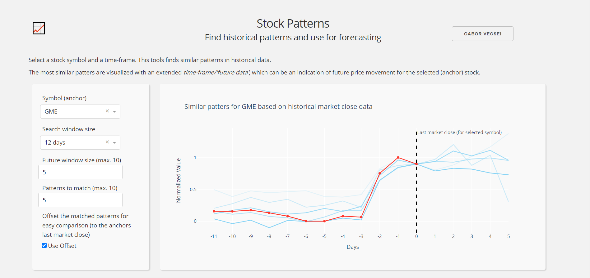

# Stocks Pattern Analyzer

</a>

## Run (for debugging)

- `python rest_api.py`
    - Wait until the data creation and search model creation is done (1-2 mins)
- `python dash_app.py`
    - The environment variable `$REST_API_URL` controls the connection with the RestAPI. It should be the base URL
- Enjoy :sunglasses: 

## Deployment to Heroku (toy deployment)

First of all, this is a mono-repo which is not ideal, but the deployment is just an example.
This is why a multi-buildpack solution is used with `heroku-community/multi-procfile`.

```bash
$ heroku create stock-restapi --remote restapi
$ heroku buildpacks:add -a stock-restapi heroku/python
$ heroku buildpacks:add -a stock-restapi -i 1 heroku-community/multi-procfile
$ heroku config:set -a stock-restapi PROCFILE=Procfile_restapi
$ git push restapi master
$
$ heroku create stock-dash-client --remote dash
$ heroku buildpacks:add -a stock-dash-client heroku/python
$ heroku buildpacks:add -a stock-dash-client -i 1 heroku-community/multi-procfile
$ heroku config:set -a stock-dash-client PROCFILE=Procfile_dash
$ heroku config:set -a stock-dash-client REST_API_URL=https://stock-restapi.herokuapp.com --> this is the URL where we can reach the RestAPI
$ git push dash master
```

Heroku Files:
- `runtime.txt` describes the Python version
- `Procfile_restapi` Heroku Procfile for the RestAPI app 
- `Procfile_dash` Heroku Procfile for the Dash Client app 

## TODOs

- Dockerized service(s)
- CLI

## References

- Style from: https://dash-gallery.plotly.host/dash-oil-and-gas/
